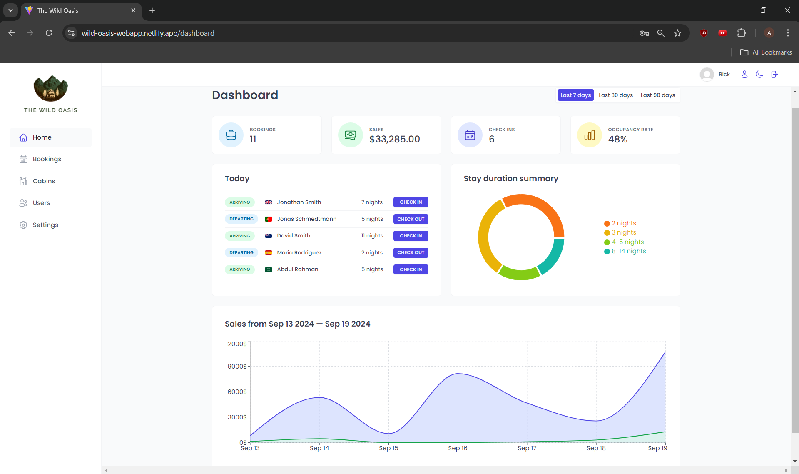
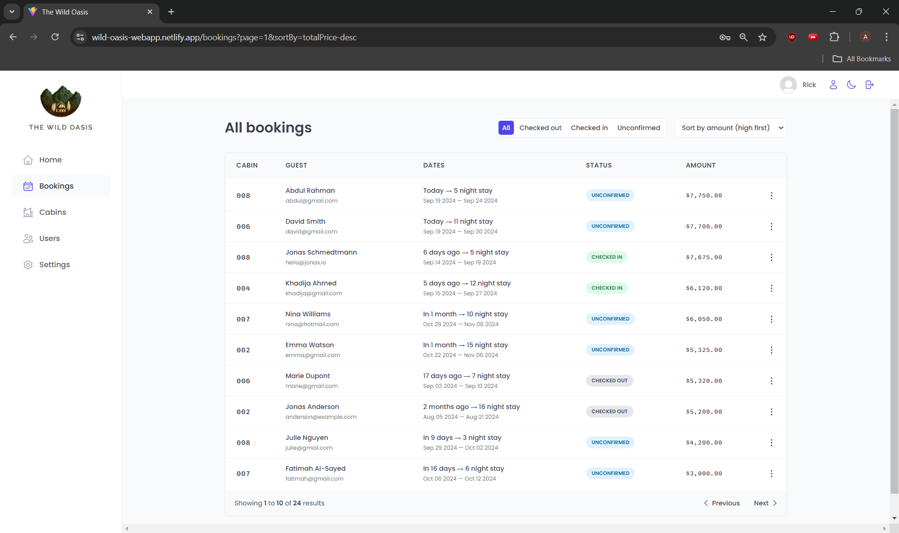
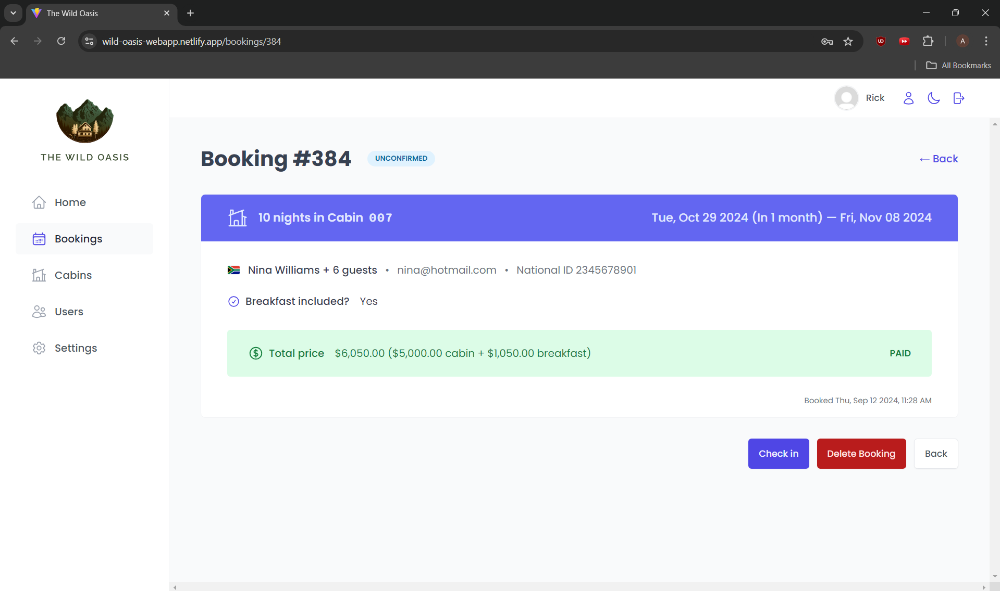
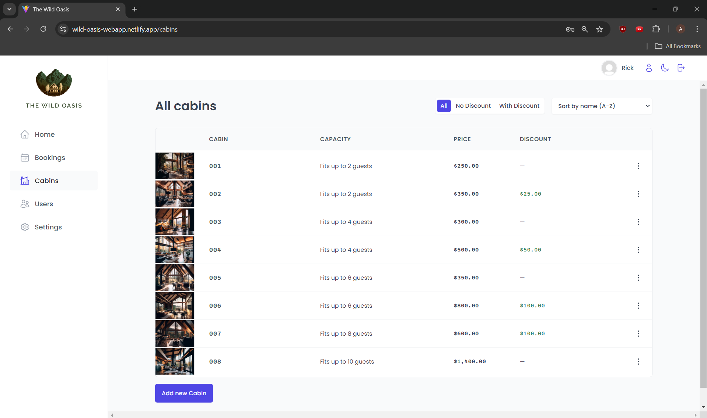
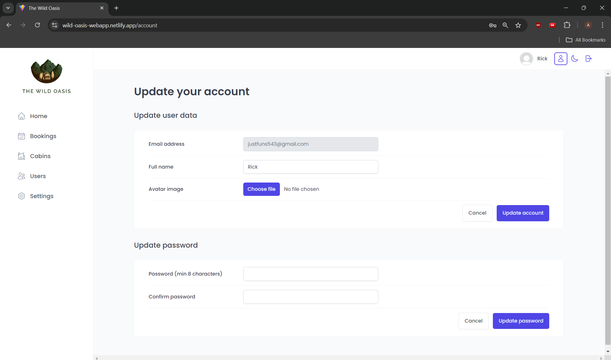

# The Wild Oasis 🏨

**The Wild Oasis** is a hotel management web application designed for hotel employees to manage bookings, check-ins, and customer details. Built using React.js and Supabase for backend services, it offers a secure and seamless user experience.

### 🔗 Live Demo
[View the live app](https://wild-oasis-webapp.netlify.app)
<br><br>
## 📂 Project Structure
```bash
the-wild-oasis/
│
├── public/                 # Public assets
├── src/
│   ├── components/         # Reusable components
│   ├── pages/              # Main pages (Dashboard, Bookings, Login, etc.)
│   ├── services/           # API calls (Supabase integration)
│   ├── context/            # App-wide contexts (Dark Mode, Auth)
│   ├── ui/                 # UI elements (Buttons, Forms, etc.)
│   ├── App.js              # Main app component with routing
│   └── index.js            # React entry point
├── README.md               # Project documentation
├── package.json            # Project dependencies
└── .gitignore              # Git ignore file
```
<br><br>
## 🛠️ Tech Stack

### Frontend:
- **React.js**
- **Styled Components**: For CSS-in-JS styling, enabling scoped and dynamic styling for each component.
- **React Router**
- **React Query**: For managing server state, caching, and syncing real-time data across components.

### Backend:
- **Supabase**: Used for authentication, storage, and database functionalities.
- **PostgreSQL**: The underlying database managed by Supabase for storing users, bookings, and related data.

### Deployment:
- Hosted on **Netlify**, ensuring continuous deployment and fast load times.
<br><br>
## ✨ Features

- **User Authentication**: Powered by Supabase, users (hotel employees) can securely log in or sign up.
- **Dashboard**: Centralized dashboard to view all bookings, manage check-ins, and view important hotel stats.
- **Booking Management**: Employees can add, view, and manage bookings with real-time updates.
- **Check-In**: Quick and easy check-in functionality directly from the booking page.
- **Responsive Design**: The app is fully responsive, built with Styled Components for a seamless experience across devices.
- **Dark Mode**: Users can switch between light and dark themes using the dark mode toggle.
<br><br>
## 🛡️ Security

- **Supabase Auth** ensures only verified users can access the application. Passwords are securely stored and encrypted.
- **Real-Time Data**: The app uses Supabase's real-time features to sync bookings data across devices.
<br><br>
## Pages
### Dashboard :-

### Bookings :-

### Booking details :-

### Cabins :-

### User update :-


